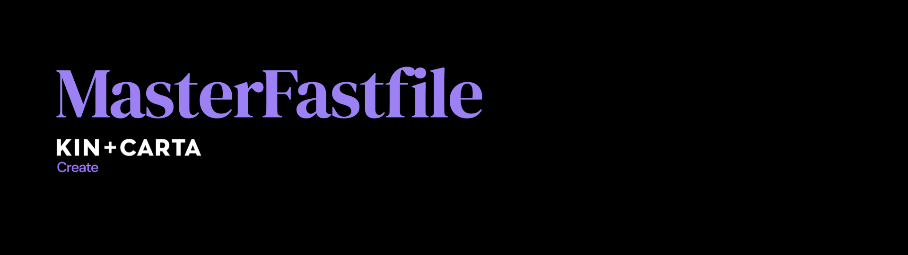

# MasterFastfile
[](https://github.com/theappbusiness/MasterFastfile/releases/latest)
[](https://github.com/theappbusiness/MasterFastfile/blob/master/LICENSE)

To setup your project to use the TAB MasterFastfile, navigate to your project root and run the following command:

```shell
curl https://raw.githubusercontent.com/theappbusiness/MasterFastfile/master/setup.sh | sh
```

Then setup your environments using the `.env` files created for you. To complete the setup just add the missing variable values.

To use the MasterFastfile add the following command to your Fastfile:

```ruby
import_from_git(url: 'https://github.com/theappbusiness/MasterFastfile.git', branch: '4.0.0', path: 'Fastfile')
```
For more detailed instructions [see our wiki](https://github.com/theappbusiness/MasterFastfile/wiki)

## Available lanes

* `test`
  * runs tests
* `ui_test`
  * runs ui tests
* `deploy_to_hockey`
  * runs tests
  * sets build number
  * installs provisioning profiles (if any are included in your Fastlane directory)
  * adds build info to app icon
  * builds and archives project
  * generates changelog from git commits
  * uploads app to hockey
* `deploy_to_hockey_no_test`
  * sets build number
  * adds build info to app icon
  * installs provisioning profiles
  * builds and archives project
  * generates changelog from git commits
  * uploads app to hockey
* `deploy_to_test_flight` (How do I find my iTunes Connect team ID? [link](https://github.com/fastlane/fastlane/issues/4301#issuecomment-253461017))
  * runs tests
  * sets build number
  * installs provisioning profiles
  * adds build info to app icon
  * builds and archives project
  * uploads app to test flight
* `local_build`
  * optionally adds icon overlay: e.g. `fastlane local_build icon_overlay:true`
  * installs provisioning profiles
  * builds an ipa

## Troubleshoot
* `TAB_PRIMARY_TARGET` if you are using multiple target in your project and it stops building for that reason, just give in the name of the target which holds the normal build number of your project

## Custom Actions

* `install_provisioning_profiles`
  * Automatically installs any provisioning profiles included in your Fastlane directory

* `icon_overlay`
  * Adds overlay to app icon containing build information

For more detailed information on how to setup your project and environment please see our [wiki](https://github.com/theappbusiness/MasterFastfile/wiki)

## Code signing

From Xcode 9 and onwards you are required to provide an export options plist. The MasterFastfile uses this to its advantage to handle as much code signing stuff as it can on your behalf.

For the MasterFastfile to fully take advantage of your export options ensure that you have defined the following environment variables:

- `GYM_EXPORT_OPTIONS`: The path to your export options, see below for how to generate these (you can choose different export options for different environments this way).
- `FL_PROJECT_SIGNING_PROJECT_PATH`: The path to your main Xcode project (not your workspace).
- `FL_UPDATE_PLIST_APP_IDENTIFIER`: The bundle identifier you want your main app target to have (you can choose a different identifier for different environments).

Export options define which provisioning profiles to use for which targets, as well as stuff like the team and export type.
The easiest way to figure out what your export options plist should contain is to manually set up code signing in Xcode\*, archive your app and then click "export...". Once exported, in the directory Xcode creates you'll be able to find an `ExportOptions.plist` file.

The MasterFastfile uses whichever export options you have set for the `GYM_EXPORT_OPTIONS` environment variable to determine which provisioning profiles to use, as well as automatically detect which team should be used to code sign the app, and which export option to use.

\*It's recommended to do this at least once anyway. You'll know for sure whether you have your code signing set up correctly, which will help debug issues you might encounter while using Fastlane.

## Dependencies

### Imagemagick
Install using brew
```shell
brew install imagemagick
```
### Ghostscript
Install using brew
```shell
brew install ghostscript
```

## License

This project is licensed under the terms of the MIT license. See the [LICENSE](LICENSE) file.
